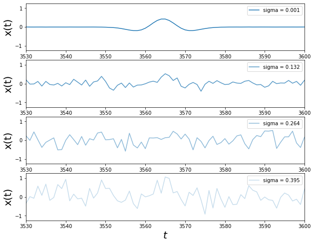
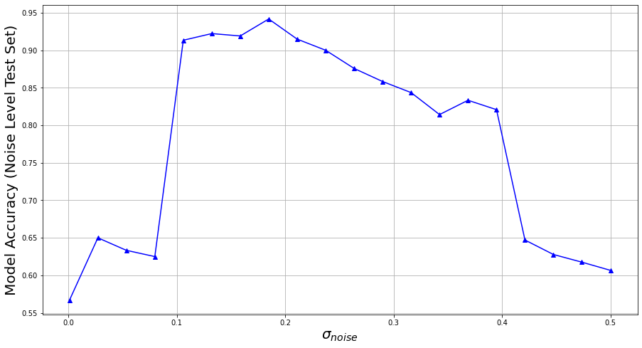

# Curriculum Learning: CNNs Applied to the Signal Detection Problem

This repo demonstrates the use of __curriculum learning__ to detect wavelets within noisy time series data. The objective is to learn a binary label, which indicates whether or not a wavelet exists in a given time series. The classification task becomes increasingly difficult as the signal-to-noise ratio (SNR) decreases, thus rendering the wavelets indiscernible against the noise.

This work is inspired by [1] and an application to astronomical data in [2].

The notebook can be found <a href="https://github.com/StuartTruax/curriculum_learning/Curriculum_Learning.ipynb">here</a>.

# Dataset and Results

The dataset consists of time series with a wavelet anomaly of decreasing signal-to-noise ratio (SNR),
as in the following figure for several noise levels:

Using curriculum learning, a CNN-based model is exposed to incrementally noisier data
for each curriculum iteration, and is tasked with classifying whether a given
sample contains the wavelet anomaly.

The curriculum method can increase its classification accuracy up to a data-dependent
noise threshold, after which the accuracy drops off, as shown below:

# References

[1] https://arxiv.org/pdf/1904.03626.pdf  (Review of Curriculum Learning)

[2] https://arxiv.org/pdf/1701.00008.pdf  (Application to LIGO Astronomical Data)

[3] https://machinelearningmastery.com/cnn-models-for-human-activity-recognition-time-series-classification/

[4] https://blog.goodaudience.com/introduction-to-1d-convolutional-neural-networks-in-keras-for-time-sequences-3a7ff801a2cf

[5] https://keras.io/api/layers/convolution_layers/convolution1d/

[6] https://keras.io/api/layers/pooling_layers/max_pooling1d/
